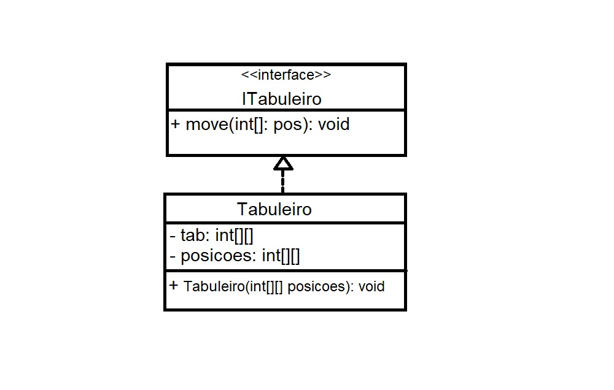
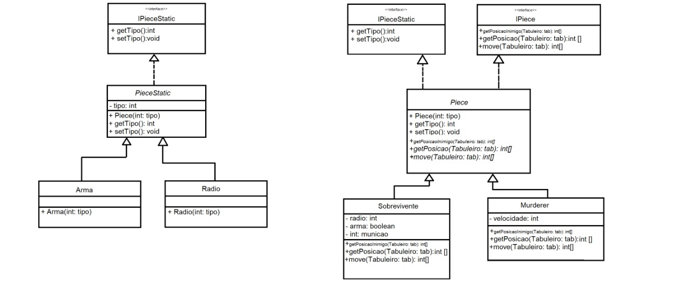

# Detalhamento do Projeto
O jogo Murderer será organizado, em UML, da seguinte maneira:

## Componentes:

## Interfaces e seus métodos:
* ITabuleiro:

  * Move: Recebe como paramâmetro as coordenadas do tabuleiro para as quais os personagens (sobrevivente e caçador) desejam ir e realiza essa movimentação no tabuleiro.
  * Tabuleiro: Construtor.
  
* IPeace e IPeaceStatic:

Como pode ser visto no diagrama, as peças do tipo rádio e arma implementaram a interface IPeaceStatic enquanto as peças moveis 
implementaram tanto IPeaceStatic quanto IPeace.
  * GetPosicaoInimigo: Recebe como parâmetro o tabuleiro e , fazendo uma busca nesse, retorna a posição do Caçador, no caso do Sobrevivente e vice-versa. 
  * GetPosicao: Recebe como parâmetro o tabuleiro e, fazendo uma busca nesse, retorna as coordenadas da peça que o chamou.
  * Move: Recebe como parâmetro o tabuleiro e, analisando a vizinhança da peça, retorna o as coordenadas do tabuleiro para qual quer se mover.
  * GetTipo: Retorna o tipo da peça (Rádio, Arma, Caçador ou Sobrevivente.)
  * SetTipo: Altera o tipo da peça.
  * Os demais métodos são construtores.
