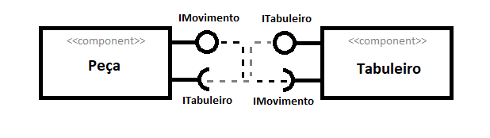
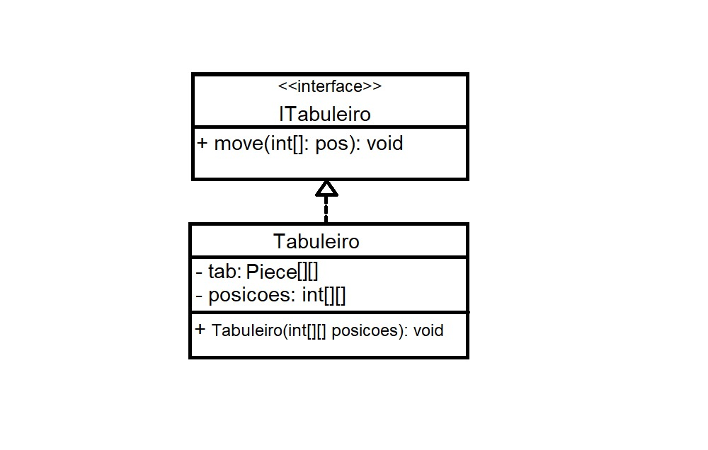
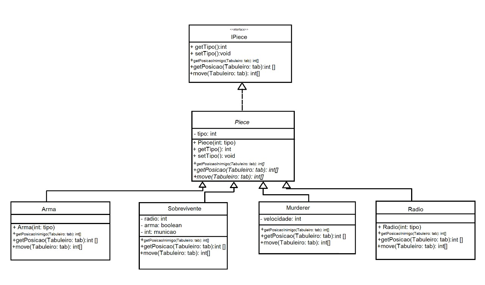

[Link dos slides](https://docs.google.com/presentation/d/1pCGv_wNoytKBnk53aXQAfj_TzJ8oRLM61EuP9PZzEOQ/edit?ts=5ec3fd09#slide=id.g858dc2d46b_0_18)

# Grupo
*Guilherme Zeferino Rodrigues Dobins, ra:236129.
*Artur Abreu Hendler, ra:231713

# Detalhamento do Projeto
O jogo Murderer será organizado, em UML, da seguinte maneira:

## Componentes:

## Interfaces e seus respectivos métodos e instâncias:
* ITabuleiro:

  * Instancias: 
     * tab: Vetor bidimensional que armazena a posiçao das peças.
     * posiçoes: Vetor bidimensional que armazena as coordenas das peças chaves (Caçador, Sobrevivente, Rádio e Arma).
  * Métodos:
     * Move: Recebe como paramâmetro as coordenadas do tabuleiro para as quais os personagens (sobrevivente e caçador) desejam ir e realiza essa movimentação no tabuleiro.
     * Tabuleiro: Construtor.
  
* IPiece:

  * Instancias: 
     * radio: Armazena o número de peças de rádio que o sobrevivente já coletou (0 a 3).
     * arma: Registra se o sobrevivente possui ou não a arma.
     * municao: Armazena quantos tiros o sobrevivente ainda pode disparar.
     * velocidade: Armazena a velocidade do Caçador (blocos por turno).
  * Métodos:
     * GetPosicaoInimigo: Recebe como parâmetro o tabuleiro e , fazendo uma busca nesse, retorna a posição do Caçador no caso do Sobrevivente e vice-versa. 
     * GetPosicao: Recebe como parâmetro o tabuleiro e, fazendo uma busca nesse, retorna as coordenadas da peça que o chamou.
     * Move: Recebe como parâmetro o tabuleiro e, analisando a vizinhança da peça, retorna o as coordenadas do tabuleiro para qual quer se mover.
     * GetTipo: Retorna o tipo da peça (Rádio, Arma, Caçador ou Sobrevivente.)
     * SetTipo: Altera o tipo da peça.
     * Os demais métodos são construtores.
