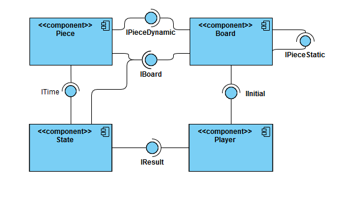
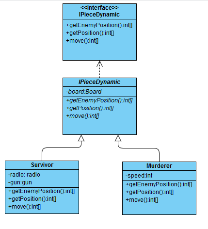
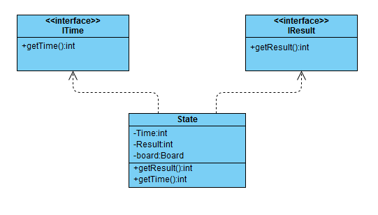
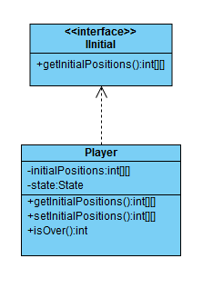

# Grupo MA141

Guilherme Zeferino Rodrigues Dobins, RA:236129

Artur Abreu Hendler, RA:231713

# Detalhamento do Projeto
[Link dos slides](https://docs.google.com/presentation/d/1pCGv_wNoytKBnk53aXQAfj_TzJ8oRLM61EuP9PZzEOQ/edit?ts=5ec3fd09#slide=id.g858dc2d46b_0_18)

O jogo Murderer é representado, em UML, pelas seguintes partes:

## Componentes:

#### Uma partida, do ponto de vista dos compontentes, ocorreria assim:

Iniciado o programa, o Componentente Player fornece ao Board a localizaçao inicial das peças (Caçador, sobrevivente, arma e partes do rádio), que por sua vez cria de fato o tabuleiro e as posiciona. Esse então fornece uma instância do tipo Board ao componente State, que computa o Tempo jogado e busca por um vencedor, e ao componente Pieces, que gera as jogadas das peças dinâmicas (Sobrevivente e Caçador). O jogo então continua dessa forma, com as jogadas das peças dinâmicas sendo feitas até que o State determine que o jogo acabou, entreguando o resultado ao Player.

## Interfaces, classes e seus respectivos métodos e instâncias:
* ITabuleiro:

  * Métodos:
     * Move: Recebe como paramâmetro as coordenadas do tabuleiro para as quais os personagens (sobrevivente e caçador) desejam ir e realiza essa movimentação no tabuleiro.
     * Tabuleiro: Construtor.
  * Instancias: 
     * tab: Vetor bidimensional que armazena a posiçao das peças.
     * posiçoes: Vetor bidimensional que armazena as coordenas das peças chaves (Caçador, Sobrevivente, Rádio e Arma).
     
* IPieceDynamic:

  * Métodos:
     * getPosicaoInimigo: Retorna a posição do Caçador no caso do Sobrevivente e vice-versa. 
     * getPosicao: Retorna as coordenadas da peça que o chamou.
     * move: Analisa a vizinhança da peça e retorna o as coordenadas do tabuleiro para qual ela deseja se mover.
   * Instancias: 
     * board: Guarda uma variável da classe Board.
     * radio: Armazena uma variável da classe radio (numero de peças de radio conseguidas).
     * gun: Armazena uma variável da classe gun (quantidade de munição disponível).
     * speed: Armazena a velocidade do Caçador (blocos por turno).
 * ITime e IResult:

 
   * Métodos:
     * getTime: Retorna o número de turnos já jogados.
     * getResult: Retorna o estado atual do jogo (Vítóra do Sobrevivente, Vitória do caçador ou Em andamento).
   * Instâncias:
     * Time: Armazena o número de turnos já jogados.
     * Result: Guarda o estado atual do jogo.
     * board: Armazena uma variável da classe Board.
* IInitial:

   * Métodos:
     * getInitialPosition: Retorna um vetor bidimensional com as posições inciais das peças.
     * setInitialPosition: Estabelece as posições iniciais.
     * isOver: Finaliza o jogo e Informa o usuário.
   * instâncias:
     * initialPositions: Armazena as posições iniciais.
     * state: Armazena uma variável da classe State.
 
 
