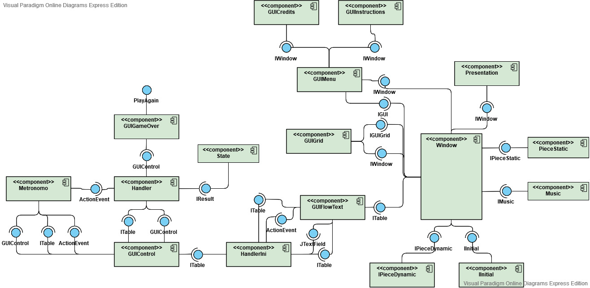

# Projeto Murderer
O projeto é um jogo do tipo simulação onde o personagem Murderer persegue o Survivor enquanto esse tenta se esquivar e buscar ajuda. O projeto foi desenvolvido com o propósito principal de treinar os conhecimentos de programação orientada a objetos e intergaces gráficas dos integrantes do grupo.

## Equipe:

 Guilherme Zeferino Rodrigues Dobins - 236129

 Artur Abreu Hendler - 231713 
  
## Videos do projeto
### [Previa do jogo (primeiro vídeo)](https://drive.google.com/file/d/1y4wc81bDpK_LgzoWiO0ZwD6kmjrHN7W8/view?usp=sharing)
### [Execução do jogo](https://drive.google.com/file/d/1szSMcByPCPwFA_lCWE14E02bafu4CwGE/view?usp=sharing)

## Slides do Projeto
### [Slides da Prévia (primeiro slide)](https://docs.google.com/presentation/d/1pCGv_wNoytKBnk53aXQAfj_TzJ8oRLM61EuP9PZzEOQ/edit?ts=5ec3fd09#slide=id.g858dc2d46b_0_18)
### [Slides da Apresentação Final]

## Relatório de Evolução
Durante o desenvolvimento do projeto, como a equipe ainda estava obtendo conhecimentos sobre interfaces gráficas, várias mudanças conceituais referentes a organização de classes e interfaces foram feitas. Isso, embora positivo do ponto de vista do aprendizado, fez com que o primeiro detalhamento feito em UML não se assemelhasse ao modelo final. Ainda no decorrer da criação, o grupo, dando ênfase à experiência do usuário, pôde implementar alguns aspectos de forma personalizada como botôes, planos de fundo e música.
## Destaques de Código

## Destaques de Pattern(? acho que n precisa colocar)
### Diagrama do Pattern
### Código do Pattern

## Conclusões e Trabalhos Futuros
Após o código ser finalizado a equipe concordou que um cuidado maior em relação ao planejamento pode facilitar consideravelmente o desenvolvimento de projetos grandes no futuro, afinal, nesses casos, quando se desenvolve em equipe acaba sendo necessário uma discussão maior do que será feito para evitar inconsistências.
## Documentação dos Componentes
### Diagrama Geral

## Plano de Exceções
