# Projeto Murderer
O projeto é um jogo do tipo simulação onde o personagem Murderer persegue o Survivor enquanto esse tenta se esquivar e buscar ajuda. O projeto foi desenvolvido com o propósito principal de treinar os conhecimentos de programação orientada a objetos e intergaces gráficas dos integrantes do grupo.

## Equipe:

 Guilherme Zeferino Rodrigues Dobins - 236129

 Artur Abreu Hendler - 231713 
  
## Videos do projeto
### [Previa do jogo (primeiro vídeo)](https://drive.google.com/file/d/1y4wc81bDpK_LgzoWiO0ZwD6kmjrHN7W8/view?usp=sharing)
### [Execução do jogo](https://drive.google.com/file/d/1szSMcByPCPwFA_lCWE14E02bafu4CwGE/view?usp=sharing)

## Slides do Projeto
### [Slides da Prévia (primeiro slide)](https://docs.google.com/presentation/d/1pCGv_wNoytKBnk53aXQAfj_TzJ8oRLM61EuP9PZzEOQ/edit?ts=5ec3fd09#slide=id.g858dc2d46b_0_18)
### [Apresentação Final](https://docs.google.com/presentation/d/118MMvXH7IwFXdzYhP3-ImI-_--WpKkF-fw_uo1WjIQE/edit?usp=sharing)

## Relatório de Evolução
Durante o desenvolvimento do projeto, como a equipe ainda estava obtendo conhecimentos sobre interfaces gráficas, várias mudanças conceituais referentes a organização de classes e interfaces foram feitas. Isso, embora positivo do ponto de vista do aprendizado, fez com que o primeiro detalhamento feito em UML não se assemelhasse ao modelo final. Ainda no decorrer da criação, o grupo, dando ênfase à experiência do usuário, pôde implementar alguns aspectos de forma personalizada como botôes, planos de fundo e música.
## Destaques de Código

## Destaques de Pattern:
~~~java

//Na classe GUIControl (Criada por um evento que notificou HandlerIni):
metro=new Metronomo(1000, table, this);
		start.addActionListener(metro);   	this.add(start);
		start.addActionListener(
		         new ActionListener() {
		            public void actionPerformed(ActionEvent e) {
		               metro.start();
		            }
		         }
		      );
		
		stop.addActionListener(metro);   	this.add(stop);
		stop.addActionListener(
		         new ActionListener() {
		            public void actionPerformed(ActionEvent e) {
		               metro.stop();
		            }
		         }
		      );
		
		
		
		speed.addActionListener(metro);   	this.add(speed);
		speed.addActionListener(
		         new ActionListener() {
		            public void actionPerformed(ActionEvent e) {
		               metro.speed();
		            }
		         }
		      );
		
		
		
		slow.addActionListener(metro);   	this.add(slow);
		slow.addActionListener(
		         new ActionListener() {
		            public void actionPerformed(ActionEvent e) {
		               metro.slow();
		            }
		         }
		      );
		
    metro.addActionListener(handler);
    //Passando agora para o código de handler:
    
    public void actionPerformed(ActionEvent evento) {
		tab.removeAll();
		
		murderer.move();
		if(result.getResult()==1) { //murderer ganhou
			win.removeAll();
			cont.metro.stop();
			GUIGameOver go= new GUIGameOver(cont, 1);
			win.add(go, BorderLayout.CENTER);
			SwingUtilities.updateComponentTreeUI(win);
		}
		survivor.move();
		if(result.getResult()==2)  { //survivor ganhou
			win.removeAll();
			cont.metro.stop();
			GUIGameOver go= new GUIGameOver(cont, 2);
			win.add(go, BorderLayout.CENTER);
			SwingUtilities.updateComponentTreeUI(win);
		}
		tab.draw();
		SwingUtilities.updateComponentTreeUI(tab);
	}
  
  /*Resumindo, GUIControl é criado por HandlerIni, que é um ActionListener de JTextField presentes em GUIFlowText, e GUIControl tem JButtons que são ouvidos por metrônomo, que por sua vez notifica Handler, que toma uma ação. */  
    
    
~~~
### Diagrama do Pattern
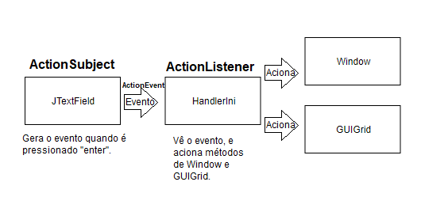
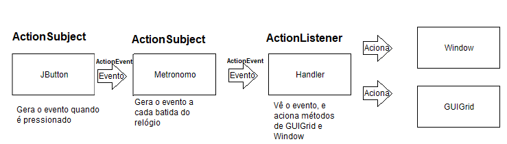
### Código do Pattern
~~~java
//Uma parte do código do Pattern adotado, no caso, trata-se do código usado no menu do jogo.

play.addActionListener(
         new ActionListener() {
            public void actionPerformed(ActionEvent e) {
               win.removeAll();
               window.create();
            }
         }
      );

stopmusic.addActionListener(
         new ActionListener() {
            public void actionPerformed(ActionEvent e) {
              music.toggle();
            }
         }
      );

instructions.addActionListener(
         new ActionListener() {
            public void actionPerformed(ActionEvent e) {
               win.removeAll();
               GUIInstructions inst = new GUIInstructions(window);
               win.add(inst, BorderLayout.CENTER);

               SwingUtilities.updateComponentTreeUI(win);
            }
         }
      );
credits.addActionListener(
         new ActionListener() {
            public void actionPerformed(ActionEvent e) {
               win.removeAll();
               GUICredits cred = new GUICredits(window);
               win.add(cred, BorderLayout.CENTER);
               SwingUtilities.updateComponentTreeUI(win);
            }
         }
		      );
          
          
~~~

## Conclusões e Trabalhos Futuros
Após o código ser finalizado a equipe concordou que um cuidado maior em relação ao planejamento pode facilitar consideravelmente o desenvolvimento de projetos grandes no futuro, afinal, nesses casos, quando se desenvolve em equipe acaba sendo necessário uma discussão maior do que será feito para evitar inconsistências.
## Documentação dos Componentes
### Diagrama Geral
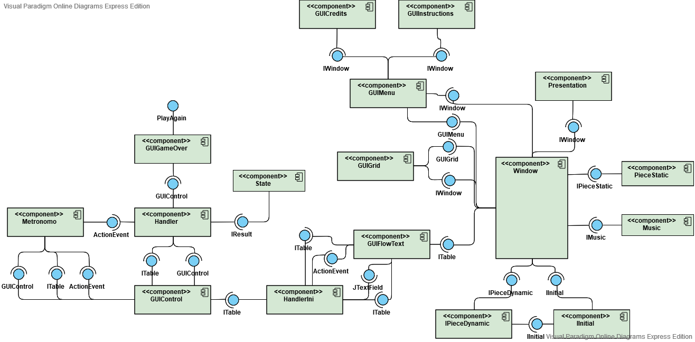

### Componente Window:
Window é responsável por gerenciar as posições dos itens e personagens no jogo, bem como os containers que serão mostrados na tela, podendo ser entendido como um Frame Composto. Por conta disso, foi o principal componente no que se diz respeito ao Pattern Composite.
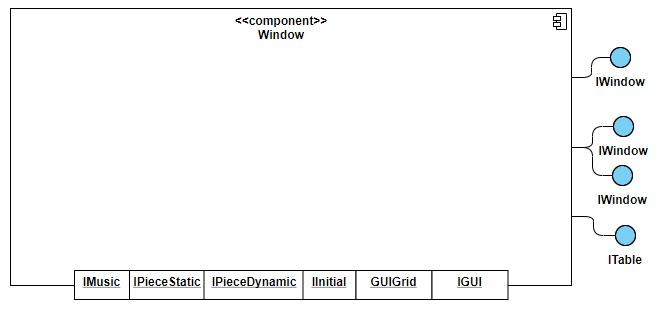

#### Ficha Técnica:
item | detalhamento
---- | ------------
Classe | src/src/all.Window.java
Autores | Guilherme Z. R. Dobins e Artur A. Hendler
Interfaces | IWindow 

### Componente GUIMenu:
Representa o menu do jogo, tendo como principais papéis gerenciar os JButtons presentes em si, e os visuais do menu.
Este componente apenas extende JPanel, e não implementa uma interface.
Assim como este componente, há outros como GUIInstructions, GUICredits e GUIGameOver possuem a mesma função: Gerenciar o visual e JButtons de alguma janela, porém possuem implementações distintas entre si, não fazendo sentido o uso de uma interface todos implementarem.

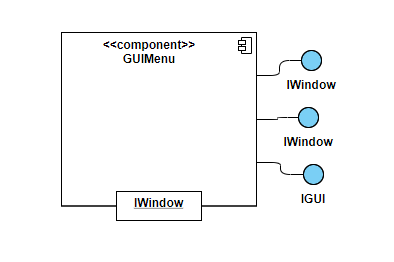

#### Ficha Técnica:
item | detalhamento
---- | ------------
Classe | src/src/all.GUIMenu.java
Autores | Guilherme Z. R. Dobins 
Interfaces | Nenhuma

### Componente GUIGrid:
Representa o mapa do jogo, apresentando os assets em um grid. É responsável pelo caráter procedural do mapa.
Por ser um container, este apenas extende JPanel, e não implementa nenhuma classe.

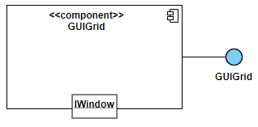

#### Ficha Técnica:
item | detalhamento
---- | ------------
Classe | src/src/all.GUIGrid.java
Autores | Guilherme Z. R. Dobins e Artur A. Hendler
Interfaces | Nenhuma

### Componente HandlerIni:
É responsável por gerenciar os ActionEvents gerados pelos JTextField presentes em GUIFlowText, verificar se as strings recebidas são válidas, e então passar a posição para a Window, assim como acionar o método draw() de GUIGrid.
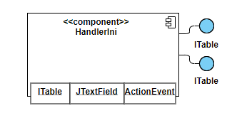

#### Ficha Técnica:
item | detalhamento
---- | ------------
Classe | src/src/all.HandlerIni.java
Autores | Guilherme Z. R. Dobins 
Interfaces | ActionListener

### Componente Metronomo:
É responsável por controlar o intervalo entre as jogadas no jogo, bem como o início do jogo e eventuais pausas. Este componente recebe um ActionEvent de um JButton presente em GUIControl, e envia um ActionEvent para Handler, sendo assim um ótimo exemplo do Pattern Composite.

 
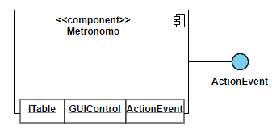

#### Ficha Técnica:
item | detalhamento
---- | ------------
Classe | src/src/all.Metronomo.java
Autores | Guilherme Z. R. Dobins 
Interfaces | ActionListener

### Componente Handler:
Gerencia os ActionEvents gerados pelo Metronomo, e é responsável por ativar o movimento dos personagens e o método draw() de GUIGrid.

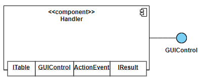

#### Ficha Técnica:
item | detalhamento
---- | ------------
Classe | src/src/all.Handler.java
Autores | Guilherme Z. R. Dobins 
Interfaces | ActionListener

### Componente PieceDynamic:
Agrega as classe Murderer e Survivor, responsáveis por gerar os movimentos dos personagens principais.
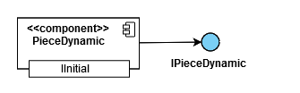

#### Ficha Técnica:
item | detalhamento
---- | ------------
Classe | src/src/all.PieceDynamic.java
Autores | Artur A. Hendler 
Interfaces | IPieceDynamic

### Componente Initial:
Responsável por armazenar as posições iniciais das peças no tabuleiro.
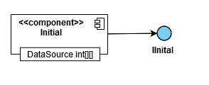

#### Ficha Técnica:
item | detalhamento
---- | ------------
Classe | src/src/all.Initial.java
Autores | Artur A. Hendler 
Interfaces | IInitial

### Componente Music:
Gerencia a reprodução da musica.
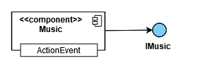

#### Ficha Técnica:
item | detalhamento
---- | ------------
Classe | src/src/all.Music.java
Autores | Artur A. Hendler 
Interfaces | ActionListener

### Componente PieceStatic:
Agrega os objetos arma e rádio, para serem passados como objetos para o Survivor.
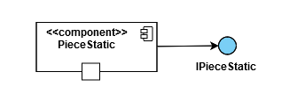

#### Ficha Técnica:
item | detalhamento
---- | ------------
Classe | src/src/all.PieceStatic.java
Autores | Artur A. Hendler 
Interfaces | IPieceStatic

### Componente State:
Responsável por checar se o jogo acabou através da função getResult.

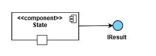

#### Ficha Técnica:
item | detalhamento
---- | ------------
Classe | src/src/all.State.java
Autores | Artur A. Hendler 
Interfaces | IResult

### Detalhamento das interfaces:
#### Interface IWindow:
A função é apenas padronizar a classe Window, com os métodos getter e setter de suas instâncias. 

Método | Objetivo
------ | ------------
getSurvivor() | Retorna o sobrevivente
getMurderer() | Retorna o murderer
getPositions() | Retorna o vetor positions, contendo as posições dos personagens e itens
getMusic() | Retorna o musica
getWin() | Retorna o container win.
create() | Cria o tabuleiro e o GUIFlowText, responsável por receber as posições digitadas pelo jogador, marcando assim o inicio do jogo.

#### Interface ITable:
A interface é usada como um objeto a ser transferido entre classes, muito útil sabendo que a maioria das classes ou passa ou recebe um GUIGrid e um Window,
duas instâncias guardadas na classe Table.

Método | Objetivo
------ | ------------
getGrid() | Retorna o GUIGrid
getWindow() | Retorna a Window

## Plano de Exceções
### Diagrama da hierarquia de exceções

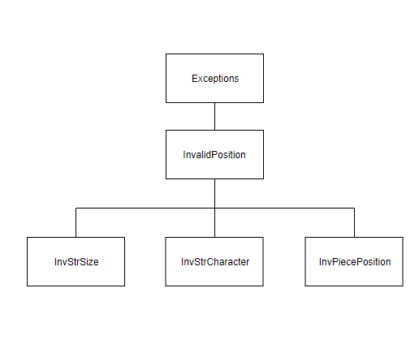

### Descrição das classes de exceção
Classe | Descrição
------ | ------------
InvalidInput | Engloba todas as exceções de inputs inválidos digitados pelo usuário.
InvPiecePosition | Indica que a posição digitada já esta sendo usada.
InvStrSize | Indica que a entrada do usuário possui um tamanho inválido (ex: 1, ou 333,33)
InvStrCharacter | Indica que há um caractere invalido na entrada do usuario 

